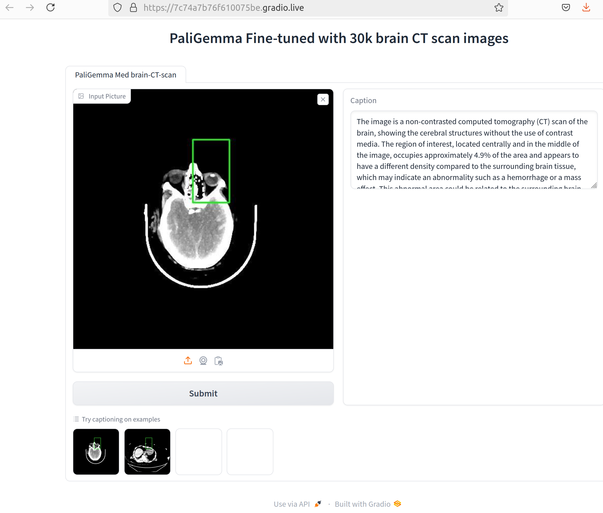

# paligemma-brain-ct-assistant
demo of using finetuned model for brain CT image detection on region of interest



### How to use it

prepare a local environment by installing requirements
```
pip install -r requirements.txt
```
next run gradio app
```
gradio app.py
```
then open your browser and connect with the link show in the console

## finetuned model
mychen76/paligemma-3b-mix-448-med_30k-ct-brain


